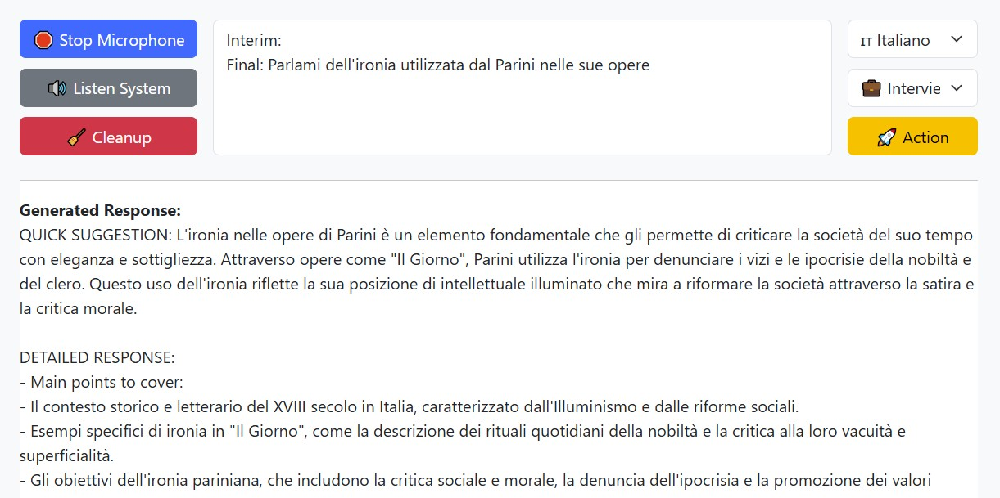

# Whisperer TelePrompter 🎙️

[](https://github.com/artsakenos/Whisperer)
[](https://github.com/artsakenos/Whisperer)


Whisperer is an intelligent🤖 speech recognition💬 assistant that acts as your real-time conversation companion. 
It provides context-aware suggestions, interactive feedback, and operates entirely in your browser.

It can be tuned to listen to any speech channel, from your microphone, from a window, a streaming video, a meeting app.

Perfect for realtime translations, interviews, presentations, 
or any scenario where you need a smart, discreet prompter by your side.



> "Think of it as your personal speech Jedi Knight 👨🚀 - it anticipates, adapts, and assists before you even finish your sentence!"

## Introduction 🕵

This application is intentionally designed to run standalone locally, without ES6 modules and the need for a server. 
For a full browser navigation assistant, see [Browser Mc Winspan](https://github.com/artsakenos/BrowserMcWingspan).

## Installation ⚡
1. Create a `config_user.js` file from `config_user_template.js` with your API keys (inside the config folder)
2. Customize other configuration files as needed
3. Launch `index.html`


## Macro Architecture 🏗️

### Speech Processing
- **Collection and Segmentation**: Select the audio channel as needed. 
  The transcript is divided into meaningful units (e.g., by sentence or question), based on speech endpoints or detected pause signals.

### Interactive Suggestion Mode
The panels show:
- The Conversation flow
- Brief, direct comments
- Detailed responses with examples or deep dives
- Context-aware assistance

The Assistant supports multiple assistance modes. Based on the mode, it performs:

- **Conversation Classification**: Each transcript segment is analyzed for context. For example, in interview mode:
  - General questions ("Tell me about yourself")
  - Technical questions ("Let's talk about Java frameworks")
  - Situational questions ("How would you handle this situation?")

- **Response Generation**: Once classified, the segment is passed to an agent that generates a response. The agent can use models trained on:
  - Standard interview questions
  - Effective response patterns for professional contexts

This is why context parameters include transcripts, interim text, final phrases, classifications, and previous responses provided up to that point.

### The Prompter
The suggester works like a teleprompter, providing assistance on a panel that must maintain stability. It can't constantly change the response, so it acts as a kind of low-pass filter based on the input context.

## Credits 🙏
* [Ai Interview Assistant](https://github.com/pixelpump/Ai-Interview-Assistant-Chrome-Extension)
* [Browser McWingspan](https://github.com/artsakenos/BrowserMcWingspan)

---
🚧 Under Active Development - Watch this space! 👀


## Test LLM ⚗️

To test if you LLM endpoint is ok you can
1. Setup the *tester agent* paramenters
2. Launch this command on the console

```js
queryLLM("test", "tester", "How is life today?", (error, response) => {
    if (error) {
        console.error("Errore:", error);
    } else {
        console.log("Risposta:", response);
    }
});
```

According to the prompt in config_prompts.js a Joke in Spanish will be output.

## TODO 🗺️
- [ ] Refine prompts and add a personal CV to the context window
- [ ] Aggiungere un caso d'uso presentazione, durante la quale fornisce esempi e suggerimenti